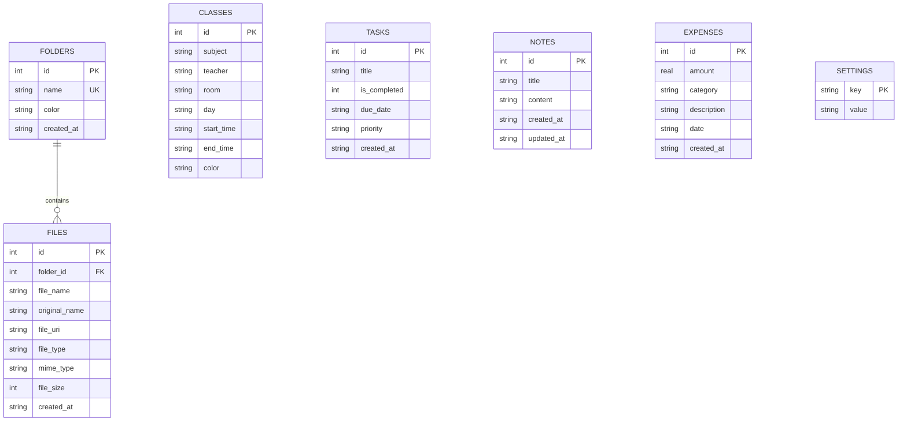

# 🎓 Student Helper

> **The ultimate, all-in-one, local-first mobile companion for college and university students.**  
> Effortlessly manage your daily timetable, study materials, assignments, quick lecture notes, and student budget — all in one offline-ready, lightning-fast app.

---

[](https://expo.dev/)
[](https://reactnative.dev/)
[](https://react.dev/)
[](https://www.typescriptlang.org/)
[](https://docs.expo.dev/router/introduction/)
[](https://docs.expo.dev/versions/latest/sdk/sqlite/)
[](./LICENSE)

---

## 📖 Table of Contents

1. [🌟 Overview](#-overview)
2. [✨ Key Features](#-key-features)
   - [🏠 Home Dashboard](#-home-dashboard)
   - [📚 Study Materials & Document Hub](#-study-materials--document-hub)
   - [📅 Timetable & Class Schedule](#-timetable--class-schedule)
   - [✅ Tasks, Assignments & Notes](#-tasks-assignments--notes)
   - [💰 Student Budget & Expense Tracker](#-student-budget--expense-tracker)
   - [🌓 Dynamic Theming (Light & Dark Mode)](#-dynamic-theming-light--dark-mode)
3. [🏗️ Architecture & Technology Stack](#️-architecture--technology-stack)
4. [💾 Database Schema & Storage Design](#-database-schema--storage-design)
5. [📂 Project Directory Structure](#-project-directory-structure)
6. [🚀 Getting Started](#-getting-started)
   - [Prerequisites](#prerequisites)
   - [Installation](#installation)
   - [Running the Application](#running-the-application)
7. [🛠️ Development & Helpful Commands](#️-development--helpful-commands)
8. [📱 Permissions & Device Integration](#-permissions--device-integration)
9. [☁️ Building with EAS](#️-building-with-eas)
10. [📄 License](#-license)

---

## 🌟 Overview

University life is chaotic: juggling multiple lecture halls, assignment deadlines, unorganized lecture slides, whiteboard photos scattered across phone galleries, and living on a tight monthly student budget.

**Student Helper** is built to solve these exact friction points in a unified, beautifully styled mobile application.

### Why Student Helper?
- **100% Local-First & Private:** All data resides on your device in a high-performance SQLite database with WAL mode enabled. No compulsory accounts, no internet required, and zero cloud tracking.
- **Dedicated Study Storage:** Whiteboard photos and imported course slides (PDFs, DOCs, PPTs) are stored directly inside the application's isolated document directory, keeping your personal camera roll decluttered.
- **Smart Timetable Awareness:** Calculates your current day and time to immediately highlight your next upcoming class with location and professor details.
- **Student-Centric Budgeting:** Tracks daily campus expenses (cafeteria, transport, printing, lab supplies) against a customizable monthly limit with visual progress meters.
- **Modern Polish:** Engineered with smooth animations, adaptive light/dark themes, ergonomic modals, and responsive feedback.

---

## ✨ Key Features

```
+-----------------------------------------------------------------------+
|                            STUDENT HELPER                             |
+-------------------+-------------------+---------------+---------------+
| 📅 Timetable      | 📚 Study Hub      | ✅ Tasks/Notes| 💰 Budget     |
| Next class alerts | Whiteboard camera | Due dates     | Daily logs    |
| Weekly schedule   | PDF/Doc importer  | Priorities    | Monthly limit |
| Room & Teacher    | Folder taxonomy   | Quick memos   | Categories    |
+-------------------+-------------------+---------------+---------------+
|               Unified Home Dashboard & Dark / Light Theme             |
+-----------------------------------------------------------------------+
```

### 🏠 Home Dashboard
- **Brand Header & Date:** Shows current day and formatted date alongside an interactive Dark Mode toggle.
- **Quick Action Bar:** One-tap shortcuts to capture a study photo, quickly add an urgent task, or log an expense.
- **Next Class Spotlight:** Intelligently inspects the weekly timetable against current day and time, showing the immediate next lecture, room number, teacher, and time range.
- **Pending Tasks Preview:** Displays top unfinished tasks with instant checkbox toggles directly from the main screen.
- **Spending At A Glance:** Displays today's spend, month-to-date total, and current budget remaining balance or overage warning.

### 📚 Study Materials & Document Hub
- **Subject Folder Taxonomy:** Create custom folders for each course (e.g., *Database Systems*, *Algorithms*, *Machine Learning*) customized with vibrant folder accent colors.
- **Whiteboard & Lecture Capture:** Built-in camera integration (`expo-image-picker`) to snap lecture whiteboards or presentation slides directly into the designated course folder.
- **Document & PDF Importer:** Pick and import course syllabi, assignments, lecture slides (`.pdf`, `.docx`, `.pptx`, `.txt`, images) using the system document picker (`expo-document-picker`).
- **Internal Storage Sandbox:** Files are safely copied into the app's persistent storage directory (`FileSystem.documentDirectory/study_materials/`) so they remain available offline even if removed from downloads.
- **Preview & Share:** Seamlessly open files or share them with classmate study groups via system sharing sheets (`expo-sharing`).
- **Real-Time Search:** Instantly filter documents and study materials by name or file extension.

### 📅 Timetable & Class Schedule
- **Day Selector Tabs:** Quickly toggle between Monday through Sunday with pill indicators displaying class counts for each day.
- **Rich Class Information:** Track Course Title, Instructor/Professor Name, Hall/Room Number, Start & End Time, and custom category colors.
- **12-Hour / 24-Hour Time Conversion:** Input times in standard 24-hour format; automatically formats cleanly into readable 12-hour AM/PM formats in the UI.
- **Full Schedule Management:** Add, update, and remove class schedules with intuitive swipeable modals.

### ✅ Tasks, Assignments & Notes
- **Dual Mode View:** Seamlessly toggle between **Tasks** (actionable items) and **Notes** (lecture notes, exam scopes, study guides).
- **Inline Quick Add:** Rapidly jot down tasks without interrupting your flow.
- **Detailed Task Metadata:** Set priorities (`High`, `Medium`, `Low`) with color-coded dot badges and track due dates.
- **Filter Views:** Filter between `All`, `Pending`, and `Completed` tasks.
- **Lecture Notes Memo:** Save rich textual memos (e.g., *"Midterm Exam Scope: Covers chapters 1–4"*), with auto-updating timestamps.

### 💰 Student Budget & Expense Tracker
- **Fast Expense Logging:** Log amount, spending category, brief description, and transaction date in seconds.
- **Categorized Tracking:** Pre-configured student categories:
  - 🍔 **Food** (Cafeteria, snacks, meals)
  - 🚌 **Transport** (Bus pass, metro, fuel)
  - 🏛️ **University** (Tuition, lab fees, semester dues)
  - 🖨️ **Printing** (Notes photocopies, thesis binding, prints)
  - 🛍️ **Shopping** (Stationery, books, gadgets)
  - 🏷️ **Other** (Miscellaneous expenditures)
- **Monthly Budget Visualizer:** Configure your monthly allowance/budget and monitor real-time progress with color-changing status bars:
  - 🟢 **Green:** Safe spending within budget
  - 🟡 **Amber:** Approaching budget limit (> 80%)
  - 🔴 **Red:** Exceeded monthly budget limit
- **Custom Currency Support:** Easily configure your local currency symbol (e.g., `Rs.`, `$`, `€`, `£`, `₹`).

### 🌓 Dynamic Theming (Light & Dark Mode)
- Specially tuned color palettes:
  - **Light Theme:** Fresh, clean slate background (`#F8FAFC`) with crisp indigo accents.
  - **Dark Theme:** Deep OLED-friendly navy-slate background (`#0B0F19`) and elevated cards (`#151D2F`) that reduce eye strain during late-night study sessions.
- Persisted state via React Context (`ThemeContext.tsx`).

---

## 🏗️ Architecture & Technology Stack

The application leverages the latest modern Expo & React Native ecosystem guidelines:

| Layer | Technology | Purpose |
|---|---|---|
| **Core Framework** | [Expo SDK 57](https://expo.dev) + [React Native 0.86](https://reactnative.dev) | Native mobile runtime (Android & iOS) |
| **Language** | [TypeScript 6.0](https://www.typescriptlang.org) | End-to-end type safety and maintainability |
| **Routing** | [Expo Router v57](https://docs.expo.dev/router/introduction/) | File-based routing with native tab navigators |
| **Database** | [expo-sqlite](https://docs.expo.dev/versions/latest/sdk/sqlite/) (Modern Async API) | Local transactional storage (WAL mode enabled) |
| **File System** | [expo-file-system](https://docs.expo.dev/versions/latest/sdk/filesystem/) | Sandboxed app file system storage for study notes |
| **Native Hardware** | [expo-image-picker](https://docs.expo.dev/versions/latest/sdk/imagepicker/) & [expo-document-picker](https://docs.expo.dev/versions/latest/sdk/document-picker/) | Camera whiteboard capture and file browsing |
| **Sharing** | [expo-sharing](https://docs.expo.dev/versions/latest/sdk/sharing/) | Native OS sharing sheet and external file viewing |
| **UI & Icons** | `@expo/vector-icons` (Ionicons) + Vanilla Stylesheets | Performant, responsive native components |

---

## 💾 Database Schema & Storage Design

Data is kept locally in SQLite database `student_helper.db`.



### Automatic Seeding
On first startup, the database automatically provisions initial records so the app is instantly usable out of the box:
- **Default Subject Folders:** *Database Systems*, *Algorithms*, *Machine Learning*, *Programming*.
- **Sample Weekly Timetable:** Pre-filled classes across Monday, Tuesday, and Wednesday.
- **Starter Tasks & Note:** Sample tasks (assignment submissions, reports) and exam scope notes.
- **Initial Expenses & Budget:** Pre-configured monthly budget (`15,000`) and currency symbol (`Rs.`).

---

## 📂 Project Directory Structure

```text
student-helper/
├── app.json                  # Expo app configuration, plugins, & Android permissions
├── package.json              # Project dependencies and npm scripts
├── tsconfig.json             # TypeScript compiler settings
├── eas.json                  # Expo Application Services build profiles
├── assets/                   # App icons, splash screens, and adaptive launcher icons
│   ├── icon.png
│   ├── logo.png
│   ├── android-icon-foreground.png
│   └── favicon.png
└── src/
    ├── app/                  # Expo Router directory (screens & layouts)
    │   ├── _layout.tsx       # Root layout (db init, safe areas, theme provider)
    │   └── (tabs)/           # Bottom tab navigator screens
    │       ├── _layout.tsx   # Tab bar definition & icons
    │       ├── index.tsx     # Home Dashboard (Next class, today's tasks, budget snapshot)
    │       ├── study.tsx     # Subject folders, whiteboard camera & file imports
    │       ├── classes.tsx   # Timetable schedule & daily class tracker
    │       ├── tasks.tsx     # Todo items, assignments, & lecture notes
    │       └── expenses.tsx  # Daily expenditure logger & monthly budget tracker
    ├── components/           # Reusable UI component library
    │   ├── common/           # Shared components
    │   │   ├── AppLogo.tsx          # Branded header logo component
    │   │   ├── Badge.tsx            # Pill status & category badges
    │   │   ├── Button.tsx           # Stylized touchable buttons
    │   │   ├── Card.tsx             # Elevated surface containers
    │   │   ├── DarkModeToggle.tsx   # Animated theme switcher
    │   │   ├── EmptyState.tsx       # Friendly zero-data screens
    │   │   ├── Input.tsx            # Form inputs & textareas
    │   │   └── ModalWrapper.tsx     # Bottom-sheet style modal wrapper
    │   ├── classes/          # Class timetable components (ClassCard)
    │   ├── study/            # Study file & folder components (FolderCard, FileItem)
    │   ├── tasks/            # Task items & note memo cards (TaskItem, NoteCard)
    │   └── expenses/         # Budget progress bars & expense items
    ├── constants/
    │   └── theme.ts          # Color tokens (Light & Dark), folder colors, category styles
    ├── context/
    │   └── ThemeContext.tsx  # React Context for system/manual dark mode toggling
    ├── database/
    │   ├── schema.ts         # SQL DDL statements, indices & WAL configuration
    │   └── db.ts             # Database connection singleton & initial seed handler
    ├── services/             # Pure data services & native bridge logic
    │   ├── timetableService.ts   # Class schedule queries, day filters, next-class finder
    │   ├── studyService.ts       # Folders & file metadata DB operations
    │   ├── fileStorageService.ts # Expo FileSystem & Sharing operations
    │   ├── taskService.ts        # Task CRUD, filters, and Notes operations
    │   └── expenseService.ts     # Expense calculations, budget aggregates & metrics
    └── types/
        └── index.ts          # Shared TypeScript interfaces & types
```

---

## 🚀 Getting Started

### Prerequisites

Ensure you have installed:
- [Node.js](https://nodejs.org/) (LTS version, v18+ recommended)
- [npm](https://www.npmjs.com/) or [Bun](https://bun.sh/)
- [Expo Go](https://expo.dev/go) app installed on your physical iOS or Android phone (or an emulator/simulator set up)

### Installation

1. **Clone the repository:**
   ```bash
   git clone https://github.com/your-username/student-helper.git
   cd student-helper
   ```

2. **Install dependencies:**
   ```bash
   npm install
   ```

### Running the Application

Start the Expo development server:

```bash
npm start
# or
npx expo start
```

Once the terminal outputs the QR code:
- **Android:** Open the **Expo Go** app and scan the terminal QR code.
- **iOS:** Open the native **Camera** app and scan the QR code to open in Expo Go.
- **Android Emulator:** Press `a` in the terminal.
- **iOS Simulator:** Press `i` in the terminal.
- **Web Browser:** Press `w` in the terminal.

---

## 🛠️ Development & Helpful Commands

| Command | Description |
|---|---|
| `npm start` | Starts the Expo dev server (Metro bundler) |
| `npm run android` | Starts Metro and attempts to launch on an active Android emulator/device |
| `npm run ios` | Starts Metro and attempts to launch on an active iOS simulator |
| `npm run web` | Starts local web preview |
| `npx tsc --noEmit` | Runs TypeScript type checking across the entire repository |
| `npx expo-doctor` | Diagnoses configuration issues and dependency mismatches |
| `npx expo install --fix` | Automatically fixes dependency versions to match Expo SDK 57 |

---

## 📱 Permissions & Device Integration

Configured natively in [`app.json`](./app.json):

- **Camera (`expo-image-picker`):**
  - Prompt: *"Allow Student Helper to take photos of notes and whiteboards."*
  - Used in Study screen to capture blackboard/whiteboard lecture notes.
- **Photo Library (`expo-image-picker`):**
  - Prompt: *"Allow Student Helper to access your photos for study materials."*
  - Used to pick slides or diagrams from the photo album.
- **Document Access (`expo-document-picker` & `expo-file-system`):**
  - Enables importing external PDF slides, Word documents, and study guides into private app storage.
- **System Sharing (`expo-sharing`):**
  - Allows opening stored files in dedicated PDF viewers or sharing via WhatsApp, AirDrop, Email, etc.

---

## ☁️ Building with EAS

This project supports **Continuous Native Generation (CNG)**. Do not edit `android/` or `ios/` folders manually. Native changes are driven by `app.json` config plugins.

To generate a standalone APK / iOS build using [EAS Build](https://docs.expo.dev/eas/index.md):

1. **Log in to EAS:**
   ```bash
   npx eas-cli login
   ```

2. **Configure or verify build configuration:**
   [`eas.json`](./eas.json) is pre-configured with development, preview, and production profiles.

3. **Build an Android APK (Preview):**
   ```bash
   npx eas-cli build --platform android --profile preview
   ```

4. **Build for iOS:**
   ```bash
   npx eas-cli build --platform ios --profile preview
   ```

---

## 📄 License

This project is open-source and distributed under the [MIT License](./LICENSE).

---

<p align="center">
  Crafted with ❤️ for students worldwide.
</p>
